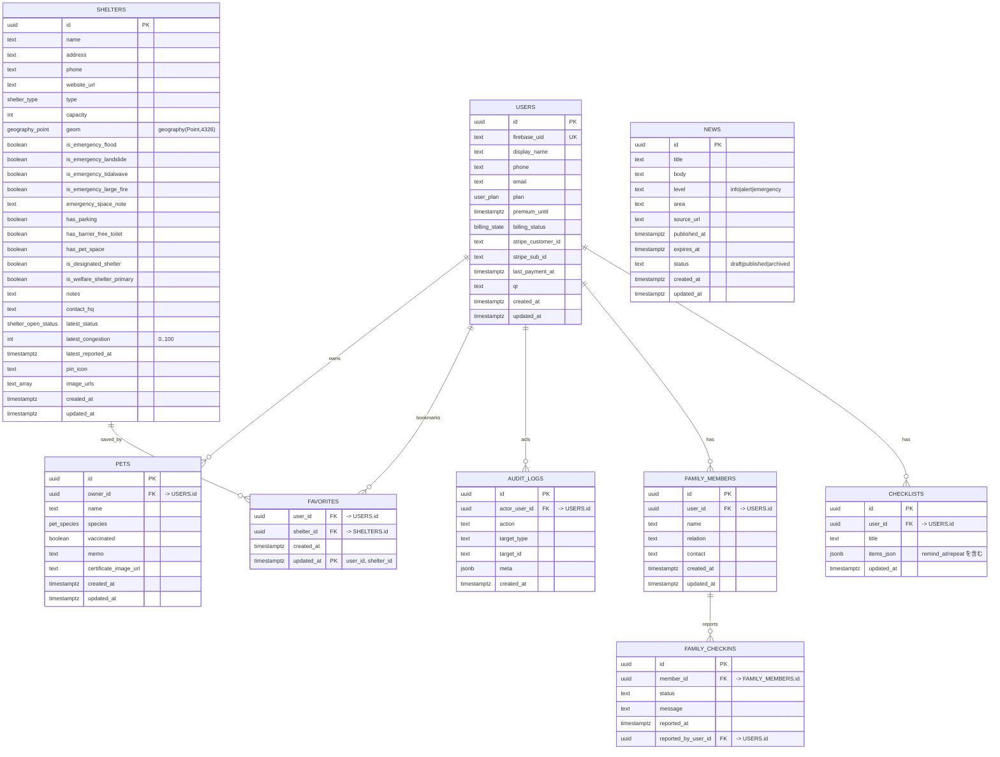

# ER 図

```mermaid
erDiagram
    USERS ||--o{ PETS : owns
    USERS ||--o{ FAVORITES : bookmarks
    USERS ||--o{ AUDIT_LOGS : acts
    USERS ||--o{ FAMILY_MEMBERS : has
    USERS ||--o{ CHECKLISTS : has
    FAMILY_MEMBERS ||--o{ FAMILY_CHECKINS : reports
    SHELTERS ||--o{ FAVORITES : saved_by

    USERS {
      uuid id PK
      text firebase_uid UK
      text display_name
      text phone
      text email
      user_plan plan
      timestamptz premium_until
      billing_state billing_status
      text stripe_customer_id
      text stripe_sub_id
      timestamptz last_payment_at
      text qr
      timestamptz created_at
      timestamptz updated_at
    }

    PETS {
      uuid id PK
      uuid owner_id FK "-> USERS.id"
      text name
      pet_species species
      boolean vaccinated
      text memo
      text certificate_image_url
      timestamptz created_at
      timestamptz updated_at
    }

    SHELTERS {
      uuid id PK
      text name
      text address
      text phone
      text website_url
      shelter_type type
      int capacity
      geography_point geom "geography(Point,4326)"
      boolean is_emergency_flood
      boolean is_emergency_landslide
      boolean is_emergency_tidalwave
      boolean is_emergency_large_fire
      text emergency_space_note
      boolean has_parking
      boolean has_barrier_free_toilet
      boolean has_pet_space
      boolean is_designated_shelter
      boolean is_welfare_shelter_primary
      text notes
      text contact_hq
      shelter_open_status latest_status
      int latest_congestion "0..100"
      timestamptz latest_reported_at
      text pin_icon
      text_array image_urls
      timestamptz created_at
      timestamptz updated_at
    }

    FAVORITES {
      uuid user_id FK "-> USERS.id"
      uuid shelter_id FK "-> SHELTERS.id"
      timestamptz created_at
      timestamptz updated_at
      PK "user_id, shelter_id"
    }

    AUDIT_LOGS {
      uuid id PK
      uuid actor_user_id FK "-> USERS.id"
      text action
      text target_type
      text target_id
      jsonb meta
      timestamptz created_at
    }

    FAMILY_MEMBERS {
      uuid id PK
      uuid user_id FK "-> USERS.id"
      text name
      text relation
      text contact
      timestamptz created_at
      timestamptz updated_at
    }

    FAMILY_CHECKINS {
      uuid id PK
      uuid member_id FK "-> FAMILY_MEMBERS.id"
      text status
      text message
      timestamptz reported_at
      uuid reported_by_user_id FK "-> USERS.id"
    }

    CHECKLISTS {
      uuid id PK
      uuid user_id FK "-> USERS.id"
      text title
      jsonb items_json "remind_at/repeat を含む"
      timestamptz updated_at
    }

    NEWS {
      uuid id PK
      text title
      text body
      text level "info|alert|emergency"
      text area
      text source_url
      timestamptz published_at
      timestamptz expires_at
      text status "draft|published|archived"
      timestamptz created_at
      timestamptz updated_at
    }
```
