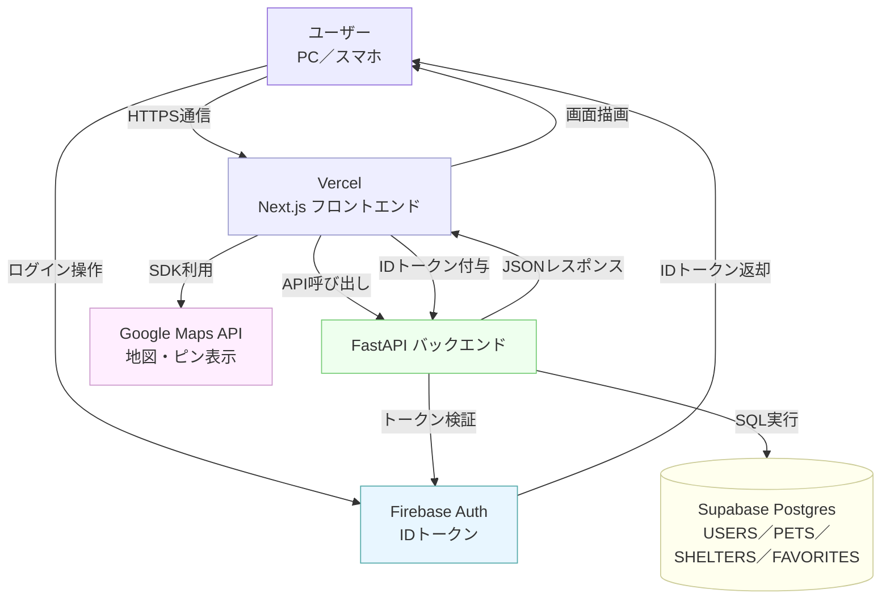

# ペット同行避難支援アプリ — **アーキテクチャ図**

_Updated: 2025-10-10T16:10:00.280273Z_

```mermaid
graph TD
    U[ユーザー\nPC／スマホ]

    FE[Vercel\nNext.js フロントエンド]:::fe
    FB[Firebase Auth\nIDトークン]:::auth
    BE[FastAPI バックエンド]:::be
    DB[(Supabase Postgres\nUSERS／PETS／SHELTERS／FAVORITES)]:::db
    GM[Google Maps API\n地図・ピン表示]:::ext

    U -->|HTTPS通信| FE
    FE -->|API呼び出し| BE
    FE -->|SDK利用| GM

    U -->|ログイン操作| FB
    FB -->|IDトークン返却| U
    FE -->|IDトークン付与| BE
    BE -->|トークン検証| FB

    BE -->|SQL実行| DB
    BE -->|JSONレスポンス| FE
    FE -->|画面描画| U

    classDef fe fill:#eef,stroke:#99c,stroke-width:1px;
    classDef be fill:#efe,stroke:#7c7,stroke-width:1px;
    classDef db fill:#ffe,stroke:#cc9,stroke-width:1px;
    classDef ext fill:#fef,stroke:#c9c,stroke-width:1px;
    classDef auth fill:#e8f6ff,stroke:#5aa,stroke-width:1px;
```
