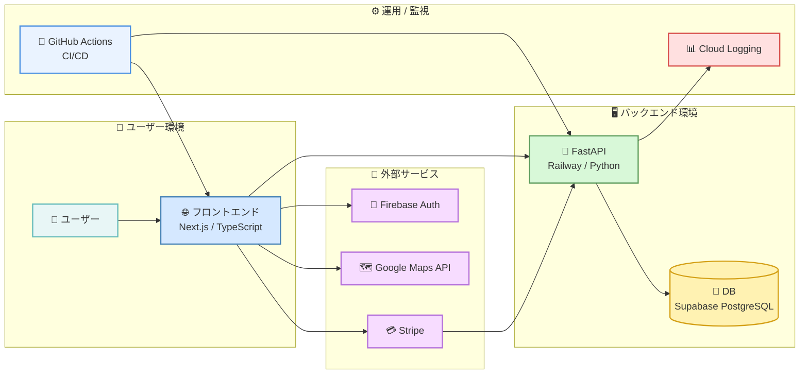

# ペット同行避難支援アプリ — アーキテクチャ概要（スライド用コンパクト版）

```mermaid
graph LR

    %% ======== ユーザー環境 ========
    subgraph "👤 ユーザー環境"
        User["📱 ユーザー"] --> FE["🌐 フロントエンド<br>Next.js / TypeScript"]
    end

    %% ======== サーバー環境 ========
    subgraph "🖥 バックエンド環境"
        FE --> BE["🚀 FastAPI<br>Railway / Python"]
        BE --> DB[("🐘 DB<br>Supabase PostgreSQL")]
    end

    %% ======== 外部サービス ========
    subgraph "🔗 外部サービス"
        FE --> Firebase["🔐 Firebase Auth"]
        FE --> Maps["🗺 Google Maps API"]
        FE --> Stripe["💳 Stripe"]
        Stripe --> BE
    end

    %% ======== 運用 ========
    subgraph "⚙️ 運用 / 監視"
        GitHub["🐙 GitHub Actions<br>CI/CD"] --> BE
        GitHub --> FE
        BE --> Logging["📊 Cloud Logging"]
    end

    %% ======== スタイル設定 ========
    style User fill:#e8f6f6,stroke:#6bb,stroke-width:2px
    style FE fill:#d5e8ff,stroke:#4682b4,stroke-width:2px
    style BE fill:#d8f8d8,stroke:#5c9c5c,stroke-width:2px
    style DB fill:#fff2b2,stroke:#d4a017,stroke-width:2px
    style Firebase fill:#f7dcff,stroke:#b36edb,stroke-width:2px
    style Maps fill:#f7dcff,stroke:#b36edb,stroke-width:2px
    style Stripe fill:#f7dcff,stroke:#b36edb,stroke-width:2px
    style GitHub fill:#eaf3ff,stroke:#4a90e2,stroke-width:2px
    style Logging fill:#ffe0e0,stroke:#d9534f,stroke-width:2px
```
