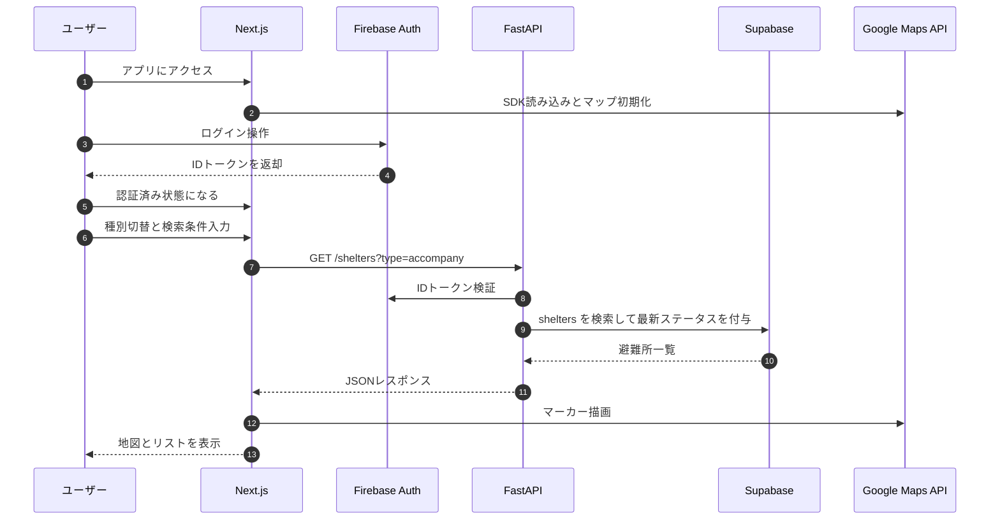
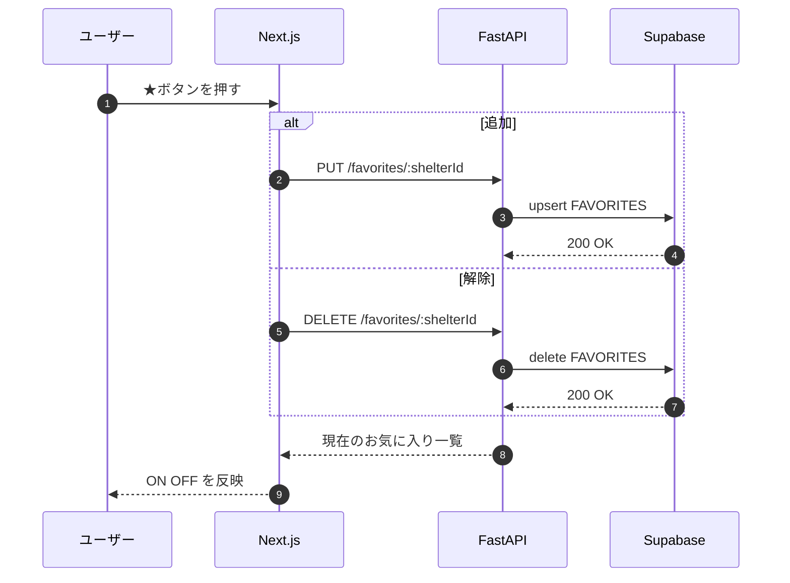

# ペット同行避難支援アプリ — **シーケンス図**

_Updated: 2025-10-10T16:10:00.280273Z_

## 1) ログインして地図を表示し避難所を検索

```mermaid
sequenceDiagram
    autonumber
    participant U as ユーザー
    participant FE as Next.js
    participant FB as Firebase Auth
    participant BE as FastAPI
    participant DB as Supabase
    participant GM as Google Maps API

    U->>FE: アプリにアクセス
    FE->>GM: SDK読み込みとマップ初期化
    U->>FB: ログイン操作
    FB-->>U: IDトークンを返却
    U->>FE: 認証済み状態になる
    U->>FE: 種別切替と検索条件入力
    FE->>BE: GET /shelters?type=accompany
    BE->>FB: IDトークン検証
    BE->>DB: shelters を検索して最新ステータスを付与
    DB-->>BE: 避難所一覧
    BE-->>FE: JSONレスポンス
    FE->>GM: マーカー描画
    FE-->>U: 地図とリストを表示
```

## 2) お気に入り登録と解除

```mermaid
sequenceDiagram
    autonumber
    participant U as ユーザー
    participant FE as Next.js
    participant BE as FastAPI
    participant DB as Supabase

    U->>FE: ★ボタンを押す
    alt 追加
        FE->>BE: PUT /favorites/:shelterId
        BE->>DB: upsert FAVORITES
        DB-->>BE: 200 OK
    else 解除
        FE->>BE: DELETE /favorites/:shelterId
        BE->>DB: delete FAVORITES
        DB-->>BE: 200 OK
    end
    BE-->>FE: 現在のお気に入り一覧
    FE-->>U: ON OFF を反映
```
